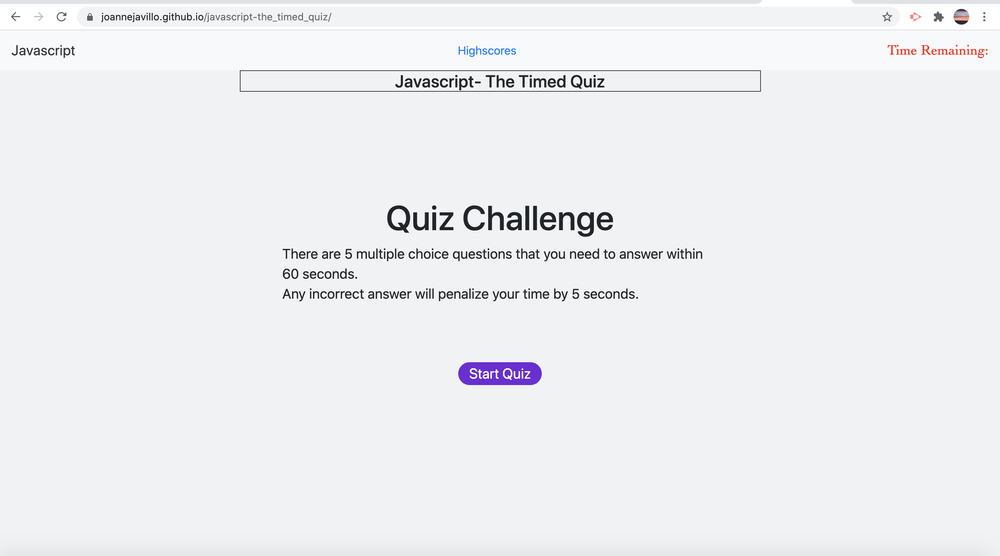

# Javascript-The_timed_quiz

---
> This exercise gave me the opportunity to learn more about the Javascript and what it can do.

---
## Goal of this exercise
**To create a timed quiz powered by Javascript**
- There are 5 multiple questions and this is a timed quiz.
- The score is based on the remaining time.
- Once the user press the start button, the time will automatically start as well.
- Everytime the user choose the answer incorrectly, 5 seconds is deducted from the timer.
- When all questions are answered, or the timer reaches 0, the quiz is done.
- The user can save his initials and this will automatically saved under highscore together with the user's score.

---
## Javascript
- Learned the use of variable, functions, arrays, conditional statements, console logs, for loop, event listener events.

----
## Link of the timed quiz in Github

[Link] (https://joannejavillo.github.io/javascript-the_timed_quiz/)

---
## Screenshots of The Timed Quiz

- Main page

